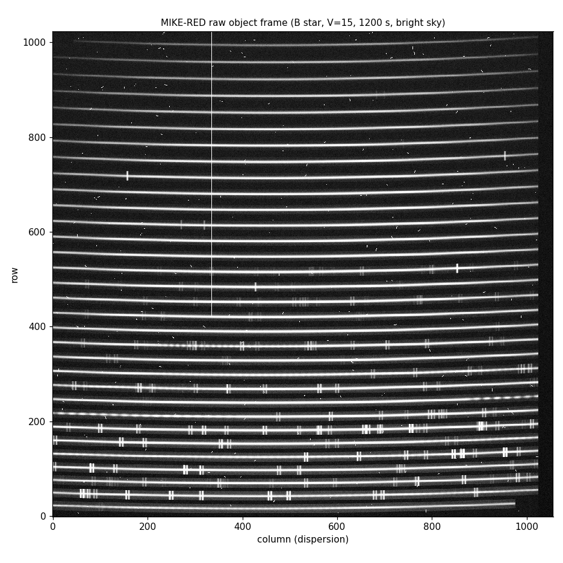

# astrojev

An observing assistant for optical telescopes (Python package and command: `obsassist`). It has four parts:
* a realistic simulated night at Keck or Magellan;
* an exposure time calculator checked against the observatories' own numbers;
* a search for the best night that was possible in hindsight;
* an assistant that combines a deterministic planner, calibrated decisions from a local LLM
  ([AnyJev](https://github.com/nokia-applied-research/AnyJev) on Qwen3) and GPT-5.6 deliberation.

It runs on a Mac. It works offline except for the optional GPT calls. It can sit next to a real
console on a real run.



## Contents

| Part | What it does |
|---|---|
| **Console** `obsassist console` | A simulated control room in the browser. The telescope operator slews, acquires and closes for weather. The instrument panel follows the MIKE/LRIS layout: one panel per arm with Exp.Time, Loops, binning and readout speed, and Start / Pause / Stop / Abort. Each readout writes a realistic FITS frame (echelle orders or a long-slit trace, sky lines, cosmic rays, overscan), which a quick-look reduces. Also in the console: a slit-viewer guider, an LCO-style weather page, a sky map with pointing limits (Keck Nasmyth deck, high-wind sector), an airmass chart with the projected plan, an ETC tab, the night log, a command line and a hindsight debrief. |
| **Assistant** `obsassist assistant` | A separate app. It watches the console (or a real run), recommends the next action with the exact commands, raises alerts (weather limits, clouds, seeing above a target's limit, ToO, frame QC, focus), answers questions and writes the night log. In autopilot it can drive the simulated console when the console allows it. Its trace records every exchange as JSON: what the console reported, the exact prompts and answers of both models, tool calls, commands and replies. |
| **ETC** `obsassist etc` | Photons to S/N for LRIS, DEIMOS, MOSFIRE, HIRES, IMACS, LDSS3, MIKE and FIRE. It accounts for seeing (DIMM with the von Kármán correction), airmass, extinction, the Moon (Krisciunas & Schaefer), twilight, clouds, Moffat slit losses, read noise, dark current, readout time and saturation. It returns S/N curves and exposure plans. See [docs/etc.md](docs/etc.md). |
| **Oracle** `obsassist oracle` | The best night in hindsight (pilot/beam search against the weather that happened) and an upper bound that no schedule can beat. |
| **Benchmarks** `python -m obsassist.learn.*` | Datasets labelled in hindsight, AnyJev head fitting, non-LLM controls, whole-night policy comparisons and merit tuning. |

Every observing decision, and who makes it, is listed in [docs/decisions.md](docs/decisions.md).

## Install (macOS or Linux, Python ≥ 3.10)

```bash
git clone https://github.com/tingyuansen/astrojev.git && cd astrojev
python3 -m venv .venv && source .venv/bin/activate    # --system-site-packages reuses an installed torch
pip install -e ".[all]"
python -m pytest -q                                   # 243 tests, a minute or two, no network or GPU needed
```

* Extras: `decide` (System 1: AnyJev at a pinned commit, torch, transformers), `llm` (System 2:
  openai), `learn` (scikit-learn, for the baselines), `dev` (pytest, ruff); `all` is all of them.
  `pip install -e .` alone runs the console, ETC, planner, oracle, and the assistant with `--no-s1`.
* System 1 downloads `Qwen/Qwen3-1.7B` (3.8 GB) from Hugging Face the first time it runs; on a Mac
  it uses the GPU (MPS).
* System 2 needs an OpenAI key in `$OPENAI_API_KEY`, or an `OPENAI=` line in `~/.env`. Without a
  key the assistant runs with the planner and System 1 only.
* Everything the tools write stays in the project: `data/` (FITS frames, datasets, traces; not
  versioned), `heads/`, `reports/`. `OBSASSIST_HOME` moves it elsewhere.
* Working on the code (or handing it to a coding agent): read [AGENTS.md](AGENTS.md).

## Run a simulated night

```bash
obsassist console --program clay_mike_darktime --speed 120          # http://127.0.0.1:8765
obsassist assistant --heads heads/qwen3-1.7b.json                    # http://127.0.0.1:8766
```

* In the console, request a target (TCS panel or `goto CS 22892-052`). Wait for "guiding", set
  Exp.Time and Loops in the arm panels, then press Start. Use ⏭ to jump to the next event and the
  Data tab to inspect each frame.
* In the assistant, use **Accept** to carry out a recommendation, or switch to **Autopilot** (the
  console must have "Assistant control" enabled). **Ask System 2** asks GPT to deliberate on the
  current call.
* Built-in programs: `clay_mike_darktime` (Magellan Clay/MIKE, dark time) and
  `keck1_lris_tonight` (Keck I/LRIS, bright time). Programs are YAML files; see
  `obsassist/programs/*.yaml` for the format.
* Assistant options: `--no-s1` runs without the local model (no download), `--no-s2` runs without
  GPT, and `--model` selects a different Hugging Face model.
* To see what the assistant proposes and why, open the console's **Assistant** tab (or
  http://127.0.0.1:8766/trace). Click a row for its JSON in and out. The same record is written to
  `data/traces/`.

## At a real telescope

The assistant only advises (Magellan publishes no scriptable TCS interface; at Keck it never runs
`modify`):

```bash
obsassist assistant --manual my_program.yaml --data /path/to/tonight/rawdata          # any telescope
obsassist assistant --manual my_program.yaml --data ... --keck-commands LRIS          # Keck: KTL lines + DCS telemetry
```

* Each recommendation is written as what to do: "Operator: go to CS 31082-001 01:29:31.14
  -16:00:45.5 J2000, rotator OFF (MIKE)" and "Instrument: Object ..., Exp.Time 1200 s, Loops 1,
  Start". At Keck it is written as `object "..."`, `tintb 1200`, `tintr 1200`, `goibr 1`.

* Report conditions (seeing, cloud, humidity, wind) and "on target / started / done" in the
  assistant. New FITS files in `--data` are booked automatically from OBJECT/EXPTIME.
* Export the target list for the operator: *Magellan catalog* (16-field format) or *Keck
  starlist*, both in the assistant UI.
* The instrument numbers marked `approximate`/`estimate` in `obsassist/instruments/*.py` should be
  replaced by your own before relying on absolute exposure times.

## How decisions are made

| Layer | What | Latency |
|---|---|---|
| **planner** | ETC and ephemerides, then a merit function (value per minute × efficiency now vs later tonight × urgency). It also projects the rest of the night under a forecast that relaxes the current seeing toward the night's own level. | ~10 ms |
| **System 1** | AnyJev over Qwen3-1.7B. Fixed typed questions: the regret of observing each candidate next (5 levels), and per-state questions (sky transparency, dome closure within 30 min). Heads (L2) are fit on simulator hindsight labels; every answer carries its calibration level. It annotates the planner's pick and sends disagreements to System 2; overriding the planner is a setting, off by default (see Results). | ~0.5 s per candidate on an M4 |
| **System 2** | GPT-5.6 (sol to deliberate, luna to chat) with tools: state, candidates, ETC, projection and frame quick-look. It gives a second opinion on disputed calls and answers questions ("what if the seeing goes to 1.2″?"). A GPT exposure time is only used if it is within 2× of the ETC plan. | 5–20 s |

The planner acts immediately, so the telescope never waits on a language model. Exposures are
taken one at a time, and the next action is re-decided after every readout.

## Results

All numbers are regenerated by the commands under *Reproduce*. Raw outputs are in `reports/`.

**The ETC against the official LCO ETC**, re-run with the same inputs: this ETC is 12–27 % more
conservative. It uses a Moffat PSF where the LCO ETC uses a Gaussian; see [docs/etc.md](docs/etc.md).
Through the quick-look, synthetic FITS frames reproduce the ETC S/N to within 3 % on average,
and the ETC's peak counts (its saturation model) to 0.86–1.07.

**The ephemerides against astropy**: altitude and azimuth agree to within 0.01° at Maunakea and Las
Campanas on four dates; LST, twilight times and the Moon also agree. The Krisciunas & Schaefer
published table is reproduced to within 5 %. The 243 tests check the physics against these
references and closed forms, and the console's timing and bookkeeping against what the planner
assumes.

**Whole nights**: 40 held-out nights (34 random programs at Keck I and Clay, and the two demo
programs under three weather seeds each), as a fraction of the pilot oracle's score:

| Policy | Mean | Worst night | vs greedy (wins/losses) |
|---|---|---|---|
| list order | 0.555 | 0.19 | 4 / 32 |
| **greedy planner** | **0.926** | 0.50 | – |
| lookahead (forecast rollouts) | 0.831 | 0.41 | 9 / 26 |

The oracle reaches 0.64 of the upper bound. The bound is a relaxation (no sequencing, no windows),
so it is loose.

**Projection accuracy** (projected minus achieved score, share of the maximum score):

| Projection made at | Bias | RMS |
|---|---|---|
| start of night | +6.4 % | 19.2 % |
| 25 % | +2.7 % | 11.2 % |
| 50 % | +2.3 % | 7.9 % |
| 75 % | +0.6 % | 5.8 % |

The forecast relaxes the seeing toward the night's own observed level; relaxing it toward the site
median instead projects poor nights about 35 % too high.

**Next-target choice, one decision at a time**: 3,601 decision states from 150 held-out nights, 56k
labelled training decisions from 600 nights. Regret is measured in hindsight, as a share of the
program's maximum score:

| Chooser | Mean regret | Within 0.5 % of best |
|---|---|---|
| random | 1.43 % | – |
| greedy planner | 0.66 % | 84.7 % |
| gradient boosting on planner numbers (no LLM) | 0.72 % | 83.9 % |
| logistic regression (no LLM) | 0.68 % | 84.1 % |

**System 1 (AnyJev on Qwen3-1.7B) on the same question.** The heads were fit on 1,203 labelled
candidates from 318 training states (LDA at layer 20 of 28). The language model is slow, so it
was tested on 120 of the held-out states, with greedy and random scored on the same states:

| Chooser | Mean regret | Within 0.5 % of best |
|---|---|---|
| random | 1.45 % | 58.3 % |
| AnyJev L0 (zero labels) | 0.85 % | 77.5 % |
| AnyJev L2, lowest expected regret | 0.77 % | 80.0 % |
| AnyJev L2, highest P(best) | 0.64 % | 83.3 % |
| greedy planner | 0.59 % | 84.2 % |

The P(best) calibration error (ECE) is 0.10. On the per-state questions, the sky transparency head
is right 99.2 % of the time, where always answering "photometric" would score 84.2 %. The dome
head (closure within 30 min) scores 98.3 %, the same as always answering "no": it has no skill.

**What this means**
* The greedy planner already makes nearly every choice that can be predicted from what is
  observable. The remaining regret against hindsight comes from weather that has not happened yet.
* Learned models do not beat it on this question, with or without an LLM.
* Tuning the merit weights on training nights moved the held-out score by +0.002 of the oracle
  (13 nights better, 11 worse), which is noise (`reports/merit_tuning.json`).
* Lookahead search loses to greedy, because it amplifies the forecast's errors.
* Where the LLM layers earn their place: reading PI notes and alerts, judging frames, explaining
  choices, deliberating on close calls and talking to you. Where the choice itself is computable,
  it stays with deterministic code.

## Reproduce

```bash
scripts/reproduce.sh        # about 1.5 h on an M-series Mac
```

It runs, all seeded:
1. `obsassist.learn.dataset`: 600 training and 150 held-out nights labelled in hindsight
   (`data/decisions/`).
2. `obsassist.learn.fit`: the AnyJev heads (`heads/qwen3-1.7b.json`) and their evaluation
   (`reports/fit_qwen3-1.7b.json`).
3. `obsassist.learn.baselines`, `evaluate` and `tune`: the non-LLM controls, the whole-night
   comparison and the merit tuning (`reports/`).
4. The tests.

Large sweeps on a cluster (OSC Slurm job arrays): [scripts/osc/](scripts/osc/README.md).

## Layout

```
obsassist/
  astro/         sites.py (Maunakea, Las Campanas, Keck, Magellan), ephem.py (night grid, alt/az, twilight, Moon), sky.py (sky brightness, seeing, ADR)
  instruments/   base.py (configuration schema), keck.py, magellan.py
  etc.py         exposure time calculator            etc_cli.py   `obsassist etc`
  targets.py     targets and programs (YAML)          weather.py   stochastic weather: truth and what the instruments report
  sim/           night.py (the night model: photons per minute, exposures, overheads, QC), frames.py (synthetic FITS + quick-look)
  planning/      planner.py (nowcast, forecast, merit, projection), oracle.py (hindsight search, upper bound),
                 lookahead.py, catalogs.py (Magellan catalog, Keck starlist), batch.py (`obsassist oracle`)
  programs/      demo programs (YAML), generator.py (random oversubscribed programs)
  console/       engine.py (TCS, dome, arms, data system), server.py (REST + WebSocket), static/ (UI)
  assistant/     observation.py (state -> text), system1.py (AnyJev), system2.py (GPT), policy.py (decision loop),
                 trace.py (every exchange as JSON), anyjev_backend.py (transformers 5 / Apple-GPU compatibility),
                 adapters/ (sim, manual, ktl helpers), server.py, static/
  learn/         dataset.py, fit.py, baselines.py, evaluate.py, tune.py
  paths.py       where generated files go (data/, heads/, reports/)
docs/            decisions.md, etc.md, research/ (sourced instrument and site numbers), img/
heads/           fitted AnyJev heads (JSON)
reports/         benchmark outputs
scripts/        reproduce.sh (every number above), osc/ (Slurm job arrays)
tests/           243 tests
data/            generated: FITS frames, datasets, assistant traces (not versioned)
AGENTS.md        how to work on the code: setup, rules, common tasks, open directions (CLAUDE.md points to it)
```

## Sources and credits

* The instrument, telescope and site numbers are in `docs/research/*.json`. Each carries a source
  URL and a confidence (documented, approximate or estimate).
* The sky and seeing models follow Krisciunas & Schaefer (1991), Patat et al. (2006), Tokovinin
  (2002), Trujillo et al. (2001), Kasten & Young (1989) and Filippenko (1982).
* AnyJev: Zhang, Yang, Shi & Wu (2026), Apache-2.0.
* The two real stars in the MIKE program (CS 22892-052, CS 31082-001) and the spectrophotometric
  standards use their public coordinates. All other targets are fictitious.

Apache-2.0.
